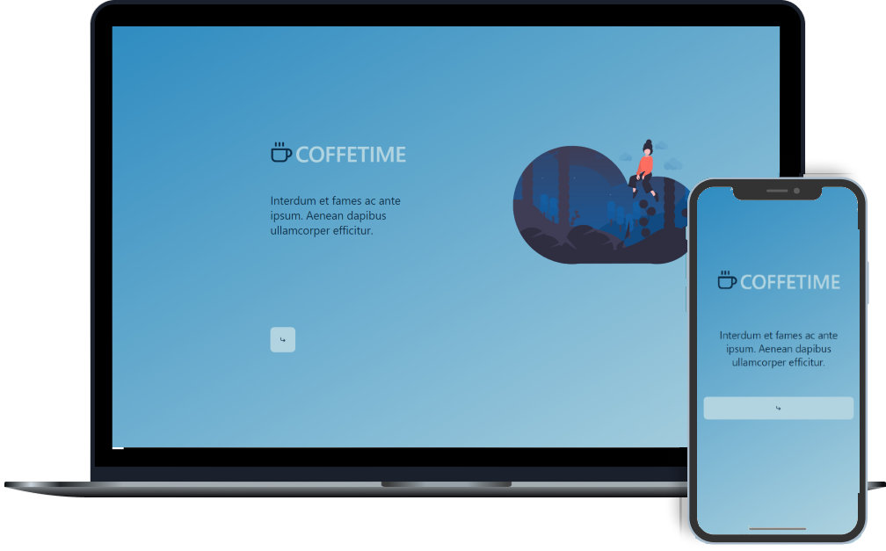

<h1 align="center">
    CoffeTime
</h1>

<h3 align="center">
  CoffeTime - Escreva assuntos que venham na sua cabeça. 
</h3>

<p align="center">
  <a href="https://www.linkedin.com/in/agra-luca/"></a>
  
  <a href="https://github.com/agraluca/solutis_app/commits/main"></a>
  
</p>

<p align="center">
  <a href="#-sobre-o-projeto">Sobre</a>&nbsp;&nbsp;&nbsp;|&nbsp;&nbsp;&nbsp;
  <a href="#-tecnologias">Tecnologias</a>&nbsp;&nbsp;&nbsp;|&nbsp;&nbsp;&nbsp;
  <a href="#-começando">Começando</a>&nbsp;&nbsp;&nbsp;|&nbsp;&nbsp;&nbsp;
  <a href="#-licença">Licença</a>
</p>

<p align="center">
  
</p>

## :bulb: Sobre o projeto

Esse projeto foi desenvolvido por Luca Agra como aplicação do processo seletivo da solutis 💙

CoffeTime é uma aplicação que te permite escrever o que vier na cabeça! Basta escolher um título, descrição e uma imagem. Te permite organizar as ideias ou simplesmente te deixar livre para escrever o que quiser!

## 🚀 Tecnologias

Technologias que eu utilizei desenvolvendo essa aplicação:

- [Node.js](https://nodejs.org/en/)
- [ReactJS](https://reactjs.org/)
- [TypeScript](https://www.typescriptlang.org/)
- [Axios](https://github.com/axios/axios)
- [React Router DOM](https://reacttraining.com/react-router/)
- [Redux](https://redux.js.org/)

Além disso implementei as seguintes funcionalidades:

- Get, Post, Put e Delete de informações da [API](https://github.com/agraluca/oladev-api) feita por mim, que inclusive está no ar e pode ser utilizada por qualquer um. :smile:
- Possui algumas rotas
- Layout Responsivo
- Animações CSS
- Deploy no Netlify: [CoffeTime](https://solutisapp.netlify.app/)

## 💻 Começando

Para começar precisamos instalar algumas coisas

### Requerimentos

- [Node.js](https://nodejs.org/en/)
- [Yarn](https://classic.yarnpkg.com/)

```bash
$ git clone https://github.com/agraluca/solutis_app && cd solutis_app
```

**Siga esses passos**

### Web

```bash

# Instale as dependências
$ yarn

# Rodando o cliente
$ yarn start
```

## 📝 Licença

Esse projeto é licenciado pelo MIT License - veja o arquivo [LICENSE](LICENSE) para mais detalhes.

---

Feito com amor 💙&nbsp; por Luca Agra 👋 &nbsp;[Veja meu linkedin](https://www.linkedin.com/in/agra-luca/)
